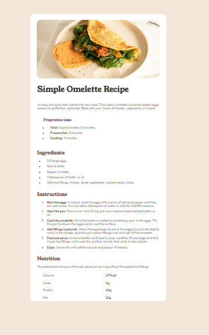

# Frontend Mentor - Recipe page solution

This is a solution to the [Recipe page challenge on Frontend Mentor](https://www.frontendmentor.io/challenges/recipe-page-KiTsR8QQKm). Frontend Mentor challenges help you improve your coding skills by building realistic projects. 

## Table of contents

- [Overview](#overview)
  - [The challenge](#the-challenge)
  - [Screenshot](#screenshot)
  - [Links](#links)
- [My process](#my-process)
  - [Built with](#built-with)
  - [What I learned](#what-i-learned)
  - [Continued development](#continued-development)
- [Author](#author)

**Note: Delete this note and update the table of contents based on what sections you keep.**

## Overview

### Screenshot

](./screenshot.jpg)

### Links

- Solution URL: [Link](https://github.com/MrUnAnonymous/recipie-solution)
- Live Site URL: [Link](https://recipie-solution.vercel.app/)

## My process

 - Started with the card and with the image and title in it.
 - Added basic styling to the page and to the card.
 - Added rest of the content to the card. 
 - Styled the components.
 - Changed the styles files to reduce lines of code.

### Built with

- Semantic HTML5 markup
- CSS custom properties
- Flexbox

### What I learned

I learned new styling techniques and how some of the elements of HTML are styled. 

### Continued development

I'll like to learn to write CSS in a better and effective way.

## Author

- Frontend Mentor - [@yourusername](https://www.frontendmentor.io/profile/yourusername)

